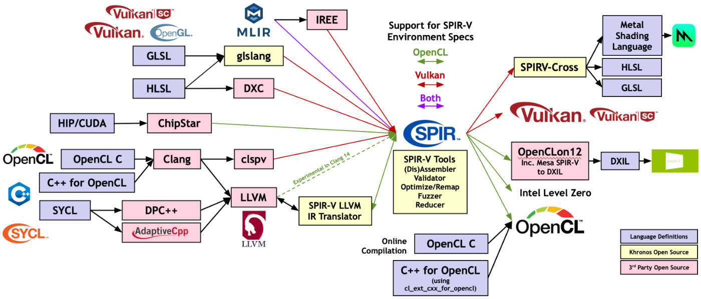
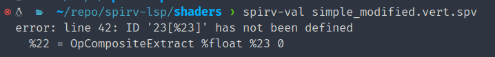
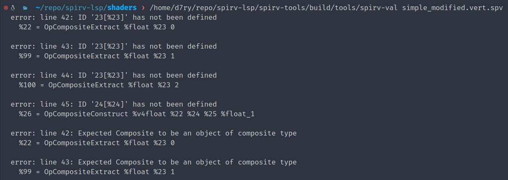
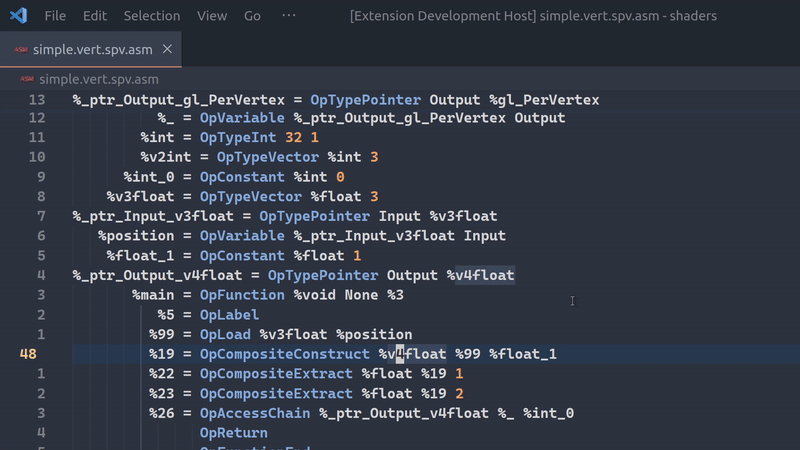
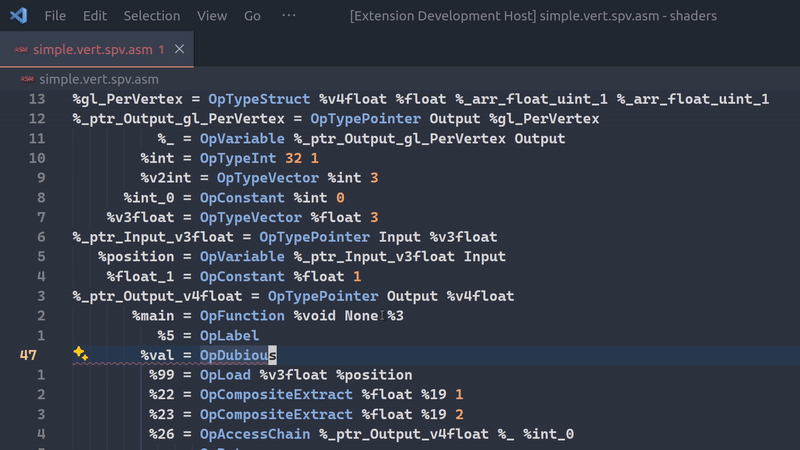

# SPIR-V Multi Validate and LSP

We extended the existing SPIR-V language tooling to allow for exhaustively checking multiple errors in a compilation unit. We integrated such multi-error checking into a C-API. We also developed a simple VSCode frontend plugin that interops with the new feature, as a proof-of-concept for a full-fledged LSP for SPIR-V language similar to clangd.

<figure>
  
  <figcaption>
      <h4 align="center">
      SPIR-V Ecosystem
      </h4>
  </figcaption>
</figure>

## Background

### SPIR-V Language

[`SPIR-V`](https://www.khronos.org/spir/) is an intermediate language targeting graphics and parallel computing. It is primarily used in the Vulkan graphics API and OpenCL. Originally developed as a dialect of LLVM IR, SPIR-V has evolved into its own specification over the years.

SPIR-V streamlines heterogeneous computing by allowing developers to use any language of their choice that compiles into SPIR-V, which is then lowered into vendor-specific implementations. This process eliminates the need for proprietary implementations of high-level graphics and compute compilers.

### SPIR-V Official Tooling

The Khronos group has implemented [SPIRV-Tools](https://github.com/KhronosGroup/SPIRV-Tools). The following three tools from the repo are often used by developers when debugging hand-written SPIR-V:

- `spirv-as`: Assembler that turns human-readable SPIR-V code into SPIR-V binary code; also performs syntax checking when transpiling.
- `spirv-dis`: Disassembler that turns SPIR-V binary code into human-readable code.
- `spirv-val`: Standalone validator that performs semantic checking on SPIR-V binary code emitted from `spirv-as`.

It is worth noting that `spirv-as` and `spirv-val` short-circuit on detecting the first error. So directly writing a frontend LSP that uses the existing C APIs provides only limited results.

<figure>
  
  <figcaption>
      <h4 align="center">
      Short-Circuited Output From spirv-val
      </h4>
  </figcaption>
</figure>

### Third-Party & Community Tooling

[spirv-viewer](https://github.com/daiyousei-qz/spirv-viewer) is a VSCode plugin that provides basic syntax highlighting, definition, and documentation on hover. However, it does not perform syntax and semantic checking.

[vscode-spvasm](https://github.com/PENGUINLIONG/vscode-spvasm) provides similar features using simple, hand-written parsing logic.

### Challenges Hand-Writing SPIR-V

Developers typically do not hand-write SPIR-V, as tools like [clspv](https://github.com/google/clspv) and [glslang](https://github.com/KhronosGroup/glslang) directly translate higher-level heterogeneous languages, such as GLSL, HLSL, and OpenCL C, into SPIR-V. However, sometimes developers hand-write SPIR-V for custom performance tweaking or experimental features.

Hand-writing SPIR-V is challenging due to SPIR-V's IR syntax and a lack of real-time syntactic and semantic checking tools. Existing toolings provide limited programming aid.

Without the tools introduced by this project, a typical SPIR-V workflow involves:

1. Editing the SPIR-V assembly code.
2. Invoking `spirv-as` to assemble the code into binary.
3. Invoking `spirv-val` to validate the binary.

If step (3) produces one error, the programmer must go back to step (1) and go over the entire loop again, jumping between multiple interfaces and inputting repetitive commands.

It would best serve low-level graphics and compute programmers, and compiler engineers' interests, to have a real-time LSP for hand-writing SPIR-V code. Before discussing the implementation, we first examine the official toolings provided by the Khronos Group and the potential challenges engineers face when using them.

## Design

Given the challenges of writing SPIR-V and the status quo of tooling, we seek to implement the following:

1. Expand the `spirv-val` tool to allow for exhaustive error checking, instead of short-circuiting behavior.
2. Integrate the exhaustive error checking in `spirv-val` into an LSP frontend, for quick hinting to the programmers of the syntactic and semantic errors.

The new features introduced should greatly improve SPIR-V tooling in terms of the convenience it provides to the programmers.

## Implementation

We implemented the design in a [custom fork of official SPIRV-Tools](https://github.com/D7ry/SPIRV-Tools) and a [VSCode extension](https://github.com/D7ry/spirv-val-vsc).

### Diagnostic Struct

`spirv-as` and `spirv-val` use the `spv_diagnostic_t` struct to store a single diagnostic, including line numbers and detailed text messages. All functions revolving around streaming, dumping, and printing diagnostics revolve around this struct, with 900+ references. Therefore, it is less practical to vectorize the struct. Instead, we added a pointer field that points to a potential next `spv_diagnostic_t` struct, making the struct a linked list. Such an implementation is minimally intrusive.

We then proceeded to modify `spvDiagnosticCreate()`, `spvDiagnosticDestroy()`, and `spvDiagnosticPrint()` to account for the linked list structure, with an additional implementation of `spvDiagnosticAppend()`.

### Message Consumer Pattern

Modifying the actual validator code poses some challenges: instead of directly writing to the diagnostics object, the validator creates a `DiagnosticStream` object, an RAII helper for flushing diagnostics into a consumer through its destructor. The consumer is a lambda function specified by the caller of the validator. In our case, it is a lambda that simply flushes to `stdout`:

```cpp
auto create_diagnostic = [diagnostic](spv_message_level_t, const char*,
                                      const spv_position_t& position,
                                      const char* message) {
  auto p = position;
  spvDiagnosticDestroy(*diagnostic);  // Avoid memory leak.
  *diagnostic = spvDiagnosticCreate(&p, message);
};
```
We modified the lambda to, instead of freeing the existing diagnostics, append to the refactored data structure:

```cpp
auto create_diagnostic = [diagnostic](spv_message_level_t, const char*,
                                   const spv_position_t& position,
                                   const char* message) {
  auto p = position;
  if (!*diagnostic) {
    *diagnostic = spvDiagnosticCreate(&p, message);
  } else {
    spvDiagnosticAppend(*diagnostic, &p, message);
  }
};
```

### Multi Diagnostics Validator

The last step to enable multiple diagnostics involves removing the short-circuiting behavior. Here we simply replace the short-circuiting `return` statement with setting a boolean for the success state of overall validation.

### Typescript Frontend

We implemented a Typescript frontend to communicate results from `spirv-val` and `spirv-as` to the editing interface. The frontend performs the following:

1. On opening SPIR-V assembly files, invoke `spirv-as` to assemble the readable file into a temporary SPIR-V binary.
    - If the assembler errors, the frontend directly shows the errored line.
2. Invoke `spirv-val` on the temporary binary, parse the results, and display errored lines and messages through VSCode.

## Results & Evaluation

### spirv-val Binary

With the modifications, the `spirv-val` binary now exhaustively examines and emits all semantic errors:

<figure>
  
  <figcaption>
      <h4 align="center">
      All Errors In One Invocation
      </h4>
  </figcaption>
</figure>

### VSCode Plugin

The VSCode plugin automatically re-invokes the validation process on file save and shows inline diagnostic results, which the programmer can easily preview by hovering:

<figure>
  
  <figcaption>
      <h4 align="center">
      Dynamic Error Display
      </h4>
  </figcaption>
</figure>

The errors displayed may be either emitted by `spirv-as` if there exists a syntax error before assembling into binary, or `spirv-val` for all semantic errors:

<figure>
  
  <figcaption>
      <h4 align="center">
      Syntax and Semantic Errors
      </h4>
  </figcaption>
</figure>

## Future Work

We intend to publish the VSCode extension to be publicly usable by all SPIR-V programmers. Before that, however, the changes to `spirv-val` must be merged into the Khronos Group's official branch.

We also seek to expand the plugin into a full-fledged LSP similar to clangd. This would eliminate the need for a VSCode frontend and provide compatibility across all IDEs. Existing tools such as [spirv-viewer](https://github.com/daiyousei-qz/spirv-viewer) already provide hover documentation functionalities, and code suggestion can be added with context from `spirv-as` and `spirv-val`. This goal, however, may require more extensive refactorings of `SPIRV-Tools`.

## Summary

In this project, we enhanced the SPIR-V tooling ecosystem by enabling exhaustive error checking in `spirv-val` and integrating it into a VSCode extension. This allows developers to receive real-time feedback on both syntactic and semantic errors while editing SPIR-V code, significantly improving the development workflow. Future work includes merging these changes into the official SPIRV-Tools repository and expanding the extension into a full-fledged LSP for broader IDE compatibility.

## References

[SPIR Overview](https://www.khronos.org/spir/)  
[clspv](https://github.com/google/clspv)  
[glslang](https://github.com/KhronosGroup/glslang)  
[SPIRV-Tools](https://github.com/KhronosGroup/SPIRV-Tools)  
[spirv-viewer](https://github.com/daiyousei-qz/spirv-viewer)  
[vscode-spvasm](https://github.com/PENGUINLIONG/vscode-spvasm)  
GitHub Copilot has been used in developing the VSCode frontend plugin.